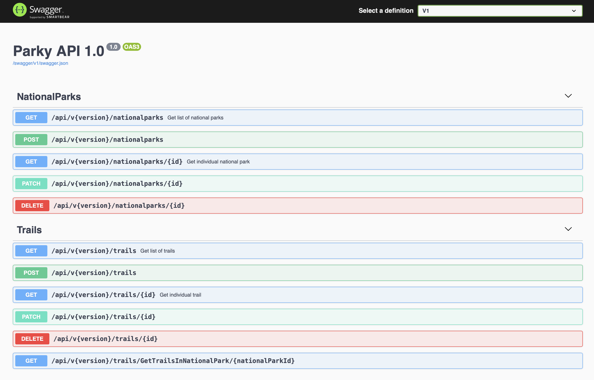

# Parky National Parks Management: RESTful API with ASP.NET 5

In this project, I followed the Udemy tutorial https://www.udemy.com/course/quick-introduction-to-aspnet-mvc-core-20.

I created a national parks project where I implemented CRUD operations using Entity Framework Core. This project is
created using ASP.NET 5.

National parks contain trails. In this project, users can see the list of national parks and trails, add new ones, edit
and delete them.

## Development Environment

ASP.NET 5 SDK and Sql Server as database are used during project development. In order to communicate with the database,
necessary Entity Framework Core packages are used.

As a result, ASP.NET 5 SDK and Sql Server are required to run this project.

## Parky API

In this API, RESTful architecture is implemented as shown in the course. There are two main resources which are
_NationalParks_ and _Trails_. NationalParks may contain Trails which means that hierarchically NationalParks is above
Trails.

_**Note:**_ Endpoints should not contain verbs according to the RESTful architecture. However, this project is
implemented as it is shown in the course. The implementation that is shown in the course does not align with RESTful
architecture. Therefore, I think it should be enhanced accordingly.

During development, code first database migration approach is used. This makes it easier for the project to run when it
is cloned. Also, repository pattern is implemented for data management.

In this project, API versioning is implemented with NuGet package _Microsoft.AspNetCore.Mvc.Versioning_. Version numbers
are accepted from endpoint routes.

Swagger is used for API documentation. As a result, documentation regarding endpoints, their request and response models
are created automatically. You can reach Swagger documentation screen via `http://localhost:5000/index.html`.

 

<i>Swagger Documentation Screen</i>
